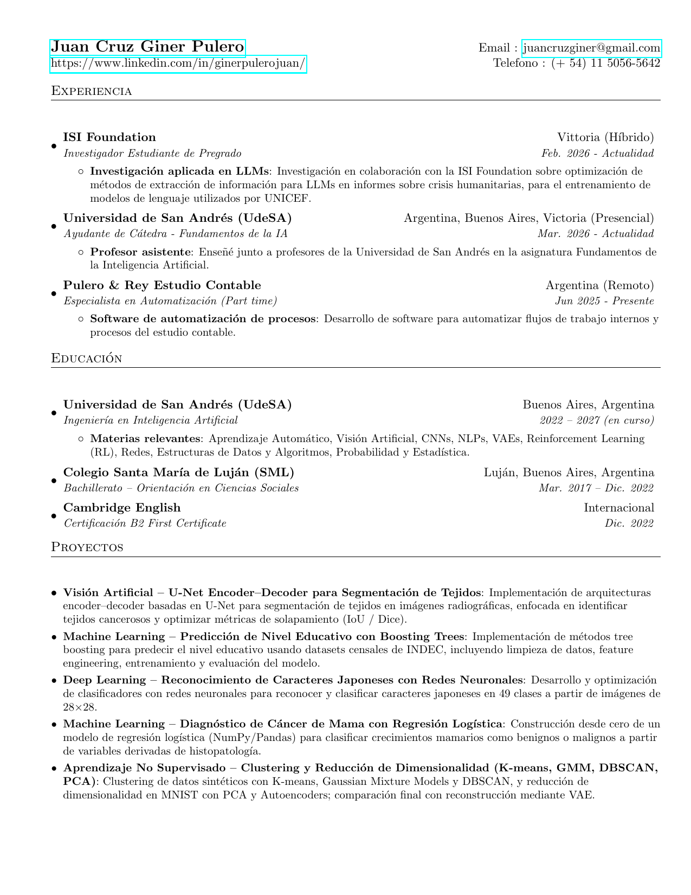
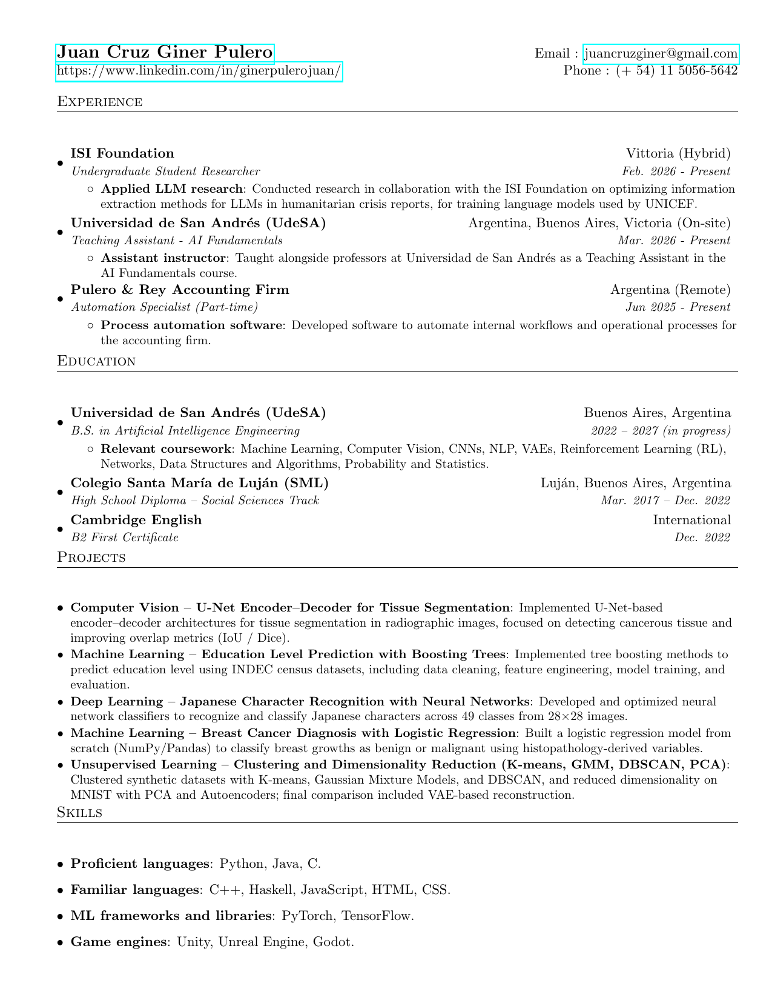

# Juan Cruz Giner Pulero — AI Engineer Curriculum

This repository showcases my **AI Engineer** curriculum vitae. I keep two versions here:

- `curriculum_sp.pdf` — Spanish version
- `curriculum_en.pdf` — English version

**Implements an Auto-build workflow:** Editing the `.tex` files automatically generates the PDFs and PNG previews on compile which are showcased below. 

## Spanish CV

[**Download Spanish CV (PDF)**](curriculum_sp.pdf)

## English CV

[**Download English CV (PDF)**](curriculum_en.pdf)

## Notes

- The LaTeX sources are `curriculum_sp.tex` and `curriculum_en.tex`.
- PNG previews are automatically generated from the PDFs on each compilation.
